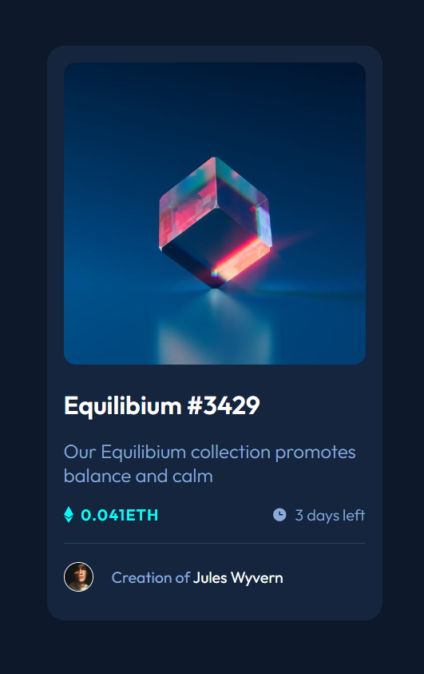
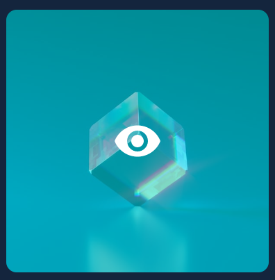

# NFT preview card

## Table of contents

- [Overview](#overview)
  - [The challenge](#the-challenge)
  - [Screenshot](#screenshot)
  - [Links](#links)
- [My process](#my-process)
  - [Built with](#built-with)
  - [What I learned](#what-i-learned)
- [Author](#author)

## Overview

### The challenge

Users should be able to:

- View the optimal layout depending on their device's screen size
- See hover states for interactive elements

### Screenshot



### Links

- [Repo](https://github.com/aaronkagan/nft-preview-card)
- [Live Site](https://fem-nft-prev-card.netlify.app/)

## My process

### Built with

- HTML5
- CSS
- Flexbox
- CSS Grid

### What I learned

Accessibility: My biggest accessibility takeways from the project were;

- Ensure there is a `<main>` element on the page
- Use accessible words for buttons, alt text, labels, aria-labels, etc, that describe the acion being taken
- Add descriptive aria labels to buttons abd inputs (among others)
- Add visually hidden, screen reader only labels to buttons abd inputs (among others). Not all screen readers read aria labels properly so having descriptive labels helps improve accesibility

```html
<label for="button-expand-nft-image" class="visually_hidden"
  >Expand NFT Image</label
>
<button
  id="button-expand-nft-image"
  aria-label="Expand NFT Image"
  class="eye-button"
>
  
</button>
```

```css
.visually_hidden {
  border: 0;
  clip: rect(0 0 0 0);
  height: 1px;
  margin: -1px;
  overflow: hidden;
  padding: 0;
  position: absolute;
  width: 1px;
}
```

Filter Overlay:
I also learned was how to use an absolutely positioned overlay to add a filter hover effect for the hover state



```html
<div class="cube-image-container">
  <div class="cube-image-overlay">
    <button class="eye-button">
      
    </button>
  </div>
  
</div>
```

```css
.cube-image-container {
  position: relative;
  font-size: 0;
}

.cube-image-overlay {
  position: absolute;
  display: grid;
  place-items: center;
  background-color: hsla(178, 100%, 50%, 0.5);
  width: 100%;
  height: 100%;
  border-radius: 1rem;
  opacity: 0;
}

.cube-image-overlay:hover {
  opacity: 100;
  cursor: pointer;
  display: grid;
}

.clear-cube-image {
  border-radius: 1rem;
  width: 100%;
  height: 100%;
}

.eye-button {
  background-color: transparent;
  border: 0;
  cursor: pointer;
}
```

## Author

- Website - [Aaron Kagan](https://www.linkedin.com/in/aaron-kagan/)
- Twitter - [@aaronkagandev](https://www.twitter.com/aaronkagandev)
